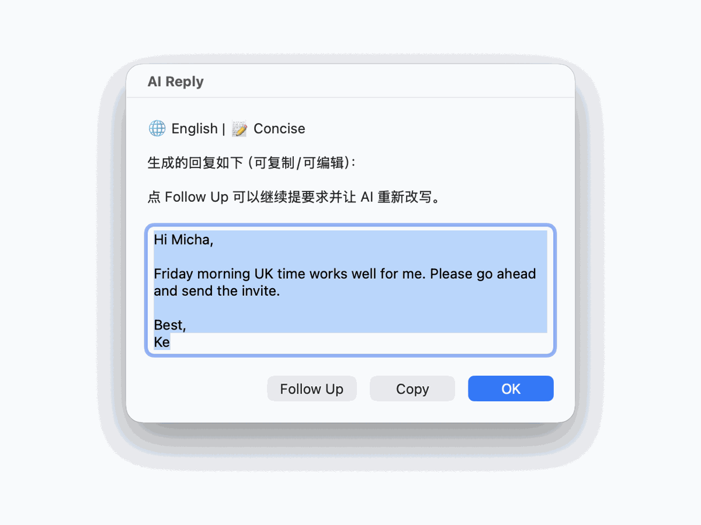
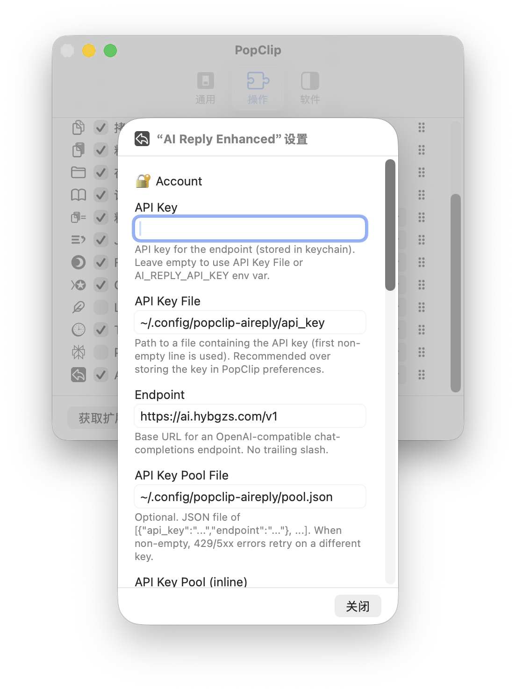
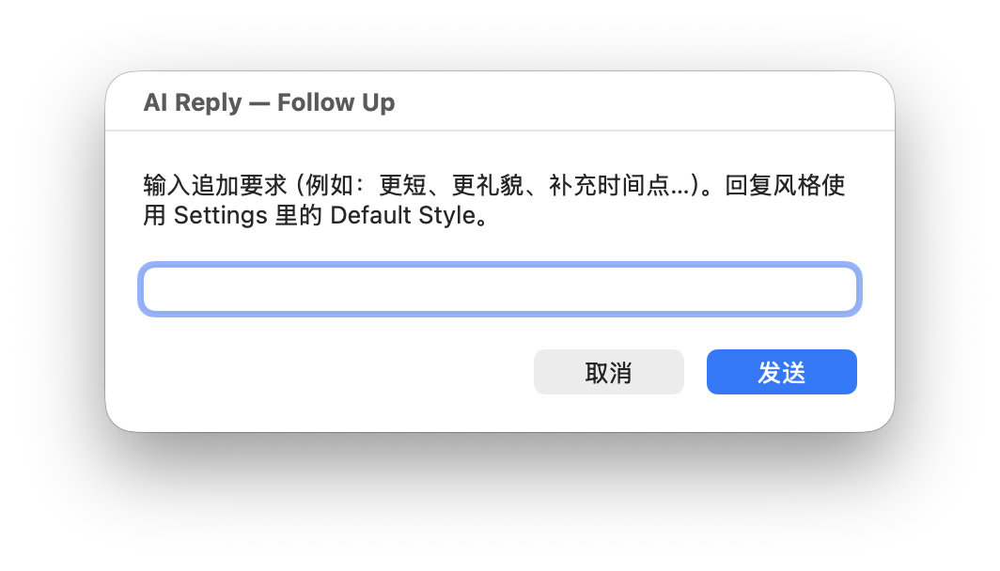

# AI Reply for PopClip / PopClip AI 快速回复

[English](#english) | [中文](#中文)



## English

AI Reply is a macOS [PopClip](https://www.popclip.app/) extension that generates polished replies from selected text using OpenAI-compatible chat completion APIs.

It is designed for quick email and message replies: select text, click **AI Reply**, optionally add a short instruction, then copy or refine the generated draft with Follow Up.

### Highlights

- Generate replies directly from selected text in any app
- Default reply style in Settings: Professional, Friendly, or Concise
- Follow-up refinement dialog for iterative edits
- OpenAI-compatible endpoint and custom model support
- API key pool with retry, 429 cooldown, and key failover
- Optional Mail.app thread context for richer replies
- Local debug/history controls with privacy-first defaults
- Shell + Python + AppleScript implementation with CI tests

### Demo


| Settings | Follow Up |
|---|---|
|  |  |

### Installation

1. Download the latest `AIReply-vX.Y.Z.popclipextz` from [Releases](../../releases).
2. Double-click the file to install it in PopClip.
3. Open PopClip Settings and configure:
   - `API Key`, or `API Key File`
   - `Endpoint Preset` (OpenAI or Custom)
   - `Model`, or `Custom Model`
   - optional `API Key Pool File`

To build locally:

```bash
zsh package.sh 0.1.0
open dist/AIReply-v0.1.0.popclipextz
```

### Usage

1. Select an email or message body.
2. Click **AI Reply** in the PopClip toolbar.
3. Optionally enter extra instructions, or leave the prompt blank.
4. Review the generated reply:
   - **OK** closes the dialog.
   - **Copy** copies the editable reply text.
   - **Follow Up** asks AI to revise the current draft.

PopClip’s toolbar contains only the main **AI Reply** action. Model, style, and key pool behavior are configured in Settings to keep the toolbar uncluttered.

### Configuration

#### API Key

Priority order:

1. PopClip Settings `API Key` field, stored as a secret option.
2. `AI_REPLY_API_KEY` environment variable, if PopClip inherits it.
3. First non-empty line of `API Key File`, defaulting to `~/.config/popclip-aireply/api_key`.

```bash
mkdir -p ~/.config/popclip-aireply
printf '%s\n' 'YOUR_KEY_HERE' > ~/.config/popclip-aireply/api_key
chmod 600 ~/.config/popclip-aireply/api_key
```

#### Endpoint And Model

- `Endpoint Preset`:
  - **OpenAI** — uses `https://api.openai.com/v1` (default).
  - **Custom** — enter your own OpenAI-compatible base URL in `Custom Endpoint`.
- `Model` is selected from Settings.
- Choose `Custom` and fill `Custom Model` to use any provider-specific model id.

Third-party OpenAI-compatible gateways may differ in available models, error formats, rate limits, and streaming behavior. This extension uses non-streaming `/chat/completions` requests.

#### Reply Behavior

- `Default Style` controls both initial replies and Follow Up revisions.
- Default style is `Concise`.
- `Reply in Source Language` asks the model to reply in the same language as the selected text.
- `Show Language Badge` displays local language detection metadata in the result dialog.

#### API Key Pool

For multiple keys, configure `API Key Pool File` in Settings. The file should contain:

```json
[
  { "api_key": "sk-aaa...", "endpoint": "https://api.openai.com/v1" },
  { "api_key": "sk-bbb...", "endpoint": "https://api.deepseek.com/v1" }
]
```

Recommended permissions:

```bash
chmod 600 ~/.config/popclip-aireply/pool.json
```

When a pool is configured, the extension retries retryable failures on another key. 429 responses honor `Retry-After` when provided and mark the key as cooling down.

#### Mail.app Context

If `Mail.app Thread Context` is enabled and Mail.app is frontmost, AI Reply can fetch recent messages from the current thread. This requires macOS Automation/Accessibility permissions for the app running PopClip.

### Privacy & Security

AI Reply sends selected text, optional prompt instructions, and optional Mail.app thread context to your configured API endpoint. Do not use it with sensitive content unless you trust that endpoint and its data handling policy.

By default:

- Conversation history is disabled.
- API keys should be stored in PopClip’s secret option or a `600` key file.
- Runtime debug files are written under `~/Library/Logs/AIReplyPopClip/` and may contain request/response metadata.
- If `Save History` is enabled, `history.jsonl` may contain selected text and generated replies.

Security-related implementation details:

- Session handoff uses JSON instead of shell `source`.
- Key pool setup treats user input as data, not executable code.
- History, key health, and key pool files use restricted permissions where applicable.
- API keys are masked in debug request metadata.

### Troubleshooting

| Symptom | What To Check |
|---|---|
| Missing API key | Set `API Key`, `API Key File`, or `AI_REPLY_API_KEY`. |
| HTTP 401/403 | Key is invalid, expired, or lacks model access. |
| HTTP 404 | Endpoint or model name is wrong for the provider. |
| HTTP 429 | You are rate-limited; key cooldown/retry should engage. |
| Empty/disappearing dialog | Check `~/Library/Logs/AIReplyPopClip/last_dialog.log`. |
| Mail.app context missing | Grant Automation/Accessibility permissions and keep Mail.app frontmost. |

Debug files are in `~/Library/Logs/AIReplyPopClip/`. Remove private content and API keys before sharing logs.

### Development

Run validation locally:

```bash
zsh -n AIReply.popclipext/reply.zsh AIReply.popclipext/lib/dialog.zsh AIReply.popclipext/pool_setup.zsh AIReply.popclipext/models.zsh
python3 -m py_compile AIReply.popclipext/lib/*.py
PYTHONPATH=AIReply.popclipext python3 -m unittest discover -s AIReply.popclipext/tests -v
```

Package for release:

```bash
zsh package.sh 0.1.0
```

The release artifact is written to `dist/AIReply-v0.1.0.popclipextz`.

### Known Limitations

- macOS + PopClip only.
- Mail.app thread context depends on local AppleScript permissions and Mail.app UI state.
- OpenAI-compatible providers may return provider-specific model names and errors.
- Demo screenshots are captured from local PopClip and macOS dialog windows with sample email text.

### License

MIT. See [LICENSE](LICENSE).

## 中文

AI Reply 是一个 macOS [PopClip](https://www.popclip.app/) 扩展，可以基于选中的邮件或文本，调用 OpenAI-compatible Chat Completions API 生成自然、可直接编辑的回复。

它适合处理邮件、客户沟通、日常消息回复：选中文本，点击 **AI Reply**，可选择性补充一句要求，然后复制结果或用 Follow Up 继续改写。

### 亮点

- 在任意 App 中选中文本即可生成回复
- 在 Settings 里配置默认风格：正式、友好、简洁
- Follow Up 对话框支持继续改写当前草稿
- 支持 OpenAI-compatible endpoint 和自定义模型
- 支持 API Key Pool、429 cooldown、重试和 key failover
- 可选 Mail.app 邮件线程上下文，让回复更贴合上下文
- 默认关闭历史记录，提供本地 debug/history 控制
- Shell + Python + AppleScript 实现，并配有 CI 测试

### 演示


| 设置界面 | Follow Up 改写 |
|---|---|
|  |  |

### 安装

1. 从 [Releases](../../releases) 下载最新的 `AIReply-vX.Y.Z.popclipextz`。
2. 双击文件安装到 PopClip。
3. 打开 PopClip Settings，至少配置：
   - `API Key` 或 `API Key File`
   - `Endpoint Preset`（OpenAI 或 Custom）
   - `Model` 或 `Custom Model`
   - 可选：`API Key Pool File`

本地构建：

```bash
zsh package.sh 0.1.0
open dist/AIReply-v0.1.0.popclipextz
```

### 使用方式

1. 选中邮件正文或任意消息文本。
2. 点击 PopClip 工具栏里的 **AI Reply**。
3. 在弹窗里输入补充要求，或留空直接发送。
4. 查看生成结果：
   - **OK** 关闭窗口。
   - **Copy** 复制当前可编辑文本。
   - **Follow Up** 基于当前草稿继续改写。

PopClip 工具栏只保留一个 **AI Reply** 主动作。模型、风格和 Key Pool 都在 Settings 里配置，避免工具栏过载。

### 配置说明

#### API Key

读取优先级：

1. PopClip Settings 里的 `API Key` 字段，使用 secret 类型保存。
2. 环境变量 `AI_REPLY_API_KEY`，前提是 PopClip 能继承该环境变量。
3. `API Key File` 文件的第一行非空内容，默认路径是 `~/.config/popclip-aireply/api_key`。

```bash
mkdir -p ~/.config/popclip-aireply
printf '%s\n' 'YOUR_KEY_HERE' > ~/.config/popclip-aireply/api_key
chmod 600 ~/.config/popclip-aireply/api_key
```

#### Endpoint 和模型

- `Endpoint Preset`：
  - **OpenAI** — 使用 `https://api.openai.com/v1`（默认）。
  - **Custom** — 在 `Custom Endpoint` 中填写你自己的 OpenAI-compatible base URL。
- `Model` 在 Settings 下拉选择。
- 如需使用任意模型 ID，选择 `Custom` 并填写 `Custom Model`。

不同第三方 OpenAI-compatible 网关在模型名称、错误格式、限速和返回行为上可能不同。本扩展使用非流式 `/chat/completions` 请求。

#### 回复行为

- `Default Style` 同时控制首轮回复和 Follow Up 改写。
- 默认风格是 `Concise`。
- `Reply in Source Language` 会要求模型使用原文语言回复。
- `Show Language Badge` 会在结果窗口显示本地检测到的语言信息。

#### API Key Pool

如果你有多个 key，可以在 Settings 中配置 `API Key Pool File`。文件格式如下：

```json
[
  { "api_key": "sk-aaa...", "endpoint": "https://api.openai.com/v1" },
  { "api_key": "sk-bbb...", "endpoint": "https://api.deepseek.com/v1" }
]
```

建议权限：

```bash
chmod 600 ~/.config/popclip-aireply/pool.json
```

配置 Pool 后，遇到可重试错误会自动切换到其他 key。429 响应会读取 `Retry-After`，并把对应 key 标记为冷却中。

#### Mail.app 上下文

如果启用 `Mail.app Thread Context`，且 Mail.app 是当前前台应用，AI Reply 可以抓取当前邮件线程中的近期消息作为上下文。这需要给 PopClip 所在进程授予 macOS Automation / Accessibility 权限。

### 隐私与安全

AI Reply 会把选中文本、可选补充要求、可选 Mail.app 线程上下文发送到你配置的 API endpoint。处理敏感内容前，请确认你信任该 endpoint 及其隐私政策。

默认情况下：

- 历史记录关闭。
- API key 建议保存在 PopClip secret 字段，或权限为 `600` 的本地文件。
- 运行时 debug 文件写入 `~/Library/Logs/AIReplyPopClip/`，可能包含请求/响应元数据。
- 如果启用 `Save History`，`history.jsonl` 可能包含选中文本和生成回复。

安全相关实现：

- session 交接使用 JSON，不使用 shell `source`。
- Key Pool 设置把用户输入当作数据处理，不拼接进可执行代码。
- history、key health、pool 文件在适用场景下使用受限权限。
- debug 请求元数据会 mask API key。

### 常见问题

| 现象 | 检查项 |
|---|---|
| Missing API key | 设置 `API Key`、`API Key File` 或 `AI_REPLY_API_KEY`。 |
| HTTP 401/403 | key 无效、过期，或没有对应模型权限。 |
| HTTP 404 | endpoint 或模型名称不适用于当前 provider。 |
| HTTP 429 | 触发限速；key cooldown / retry 会自动介入。 |
| 窗口消失或不弹出 | 查看 `~/Library/Logs/AIReplyPopClip/last_dialog.log`。 |
| Mail.app 上下文为空 | 授权 Automation/Accessibility，并确保 Mail.app 在前台。 |

Debug 文件位于 `~/Library/Logs/AIReplyPopClip/`。分享日志前请删除私人内容和 API key。

### 开发

本地验证：

```bash
zsh -n AIReply.popclipext/reply.zsh AIReply.popclipext/lib/dialog.zsh AIReply.popclipext/pool_setup.zsh AIReply.popclipext/models.zsh
python3 -m py_compile AIReply.popclipext/lib/*.py
PYTHONPATH=AIReply.popclipext python3 -m unittest discover -s AIReply.popclipext/tests -v
```

打包发布：

```bash
zsh package.sh 0.1.0
```

产物会写入 `dist/AIReply-v0.1.0.popclipextz`。

### 已知限制

- 仅支持 macOS + PopClip。
- Mail.app 线程上下文依赖本地 AppleScript 权限和 Mail.app UI 状态。
- 不同 OpenAI-compatible provider 的模型名称和错误格式可能不同。
- Demo 截图来自本地 PopClip 和 macOS 对话框窗口，内容使用示例邮件文本。

### License

MIT。详见 [LICENSE](LICENSE)。
